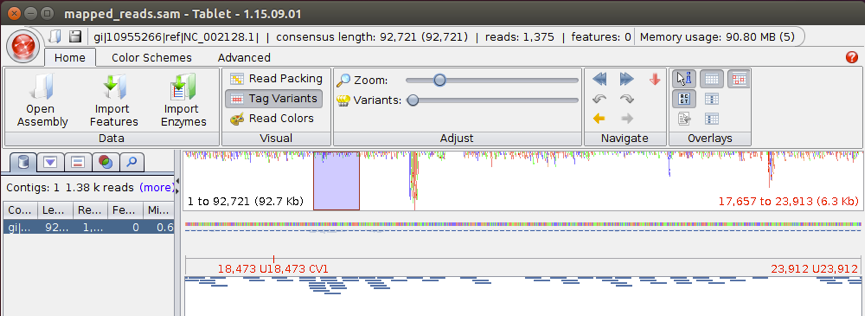
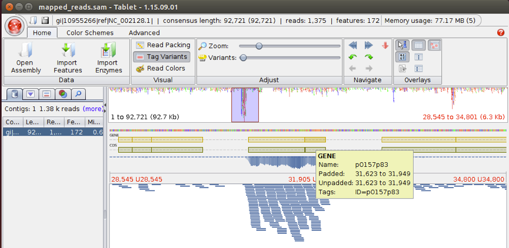

# Mapping and variant calling

In this practical you will learn to map NGS reads to a reference sequence, check the output using a viewer software and investigate some aspects of the results. You will be using the read data from the [Quality Control](qc.md) practical.

EHEC O157 strains generally carry a large virulence plasmid, pO157. Plasmids are circular genetic elements that many bacteria carry in addition to their chromosomes. This particular plasmid encodes a number of proteins which are known or suspected to be involved in the ability to cause severe disease in infected humans. Your task in this practical is to map your prepared read set to a reference sequence of the virulence plasmid, to determine if the pO157 plasmid is present in the St. Louis outbreak strain.

## Read mapping

### downloading a reference

You will need a reference sequence to map your reads to. You can download the reference from [here](data/pO157_Sakai.fasta)

or from the command-line with

`wget https://raw.githubusercontent.com/HadrienG/tutorials/master/data/pO157_Sakai.fasta`

This file contains the sequence of the pO157 plasmid from the Sakai outbreak strain of E. coli O157. In contrast to the strain we are working on, this strain is available as a finished genome, i.e. the whole sequence of both the single chromosome and the large virulence plasmid are known.

### indexing the reference

Before aligning the reads against a reference, it is necessary to build an index of that reference:

```
module load bowtie2
bowtie2-build pO157_Sakai.fasta pO157_Sakai
```

### aligning reads

`bowtie2 -x pO157_Sakai -1 reads_1.fastq -2 reads_2.fastq -S output.sam`

The output of the mapping will be in SAM format. you can find a brief explanation of the SAM format [here](files_formats.md)

### visualising the alignment

To view the outcome of the read mapping, we will use a program called Tablet, that can be run without administrated privileges. Download it [here](https://ics.hutton.ac.uk/tablet/).

Start the program and select Red Button – Open. Choose your SAM-file and pO157_Sakai.fasta as a reference.


Select the only contig to the left.



Next, download pO157_Sakai.gff from [here](data/pO157_Sakai.gff). Select import features in Tablet and import pO157_Sakai.gff. This file contains annotations, i.e. what is encoded in each part of the DNA sequence. Two tracks (CDS + GENE) will be added.

Navigate the mapping using the zoom and pan left/right etc. Under Colour schemes you can highlight bases that do not match the reference. Holding your pointer over a CDS will show you a description of the genetic region.



Does the mapping data confirm the presence of an intact pO157 plasmid in the St. Louis outbreak strain?
